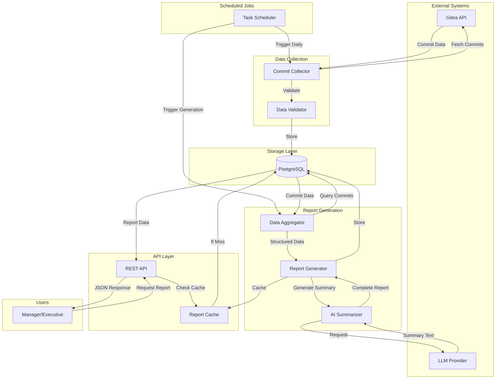
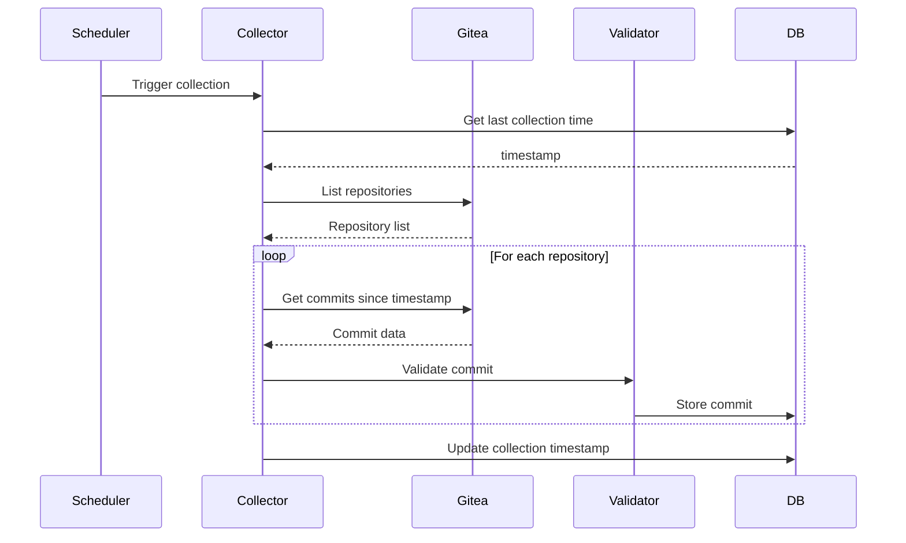
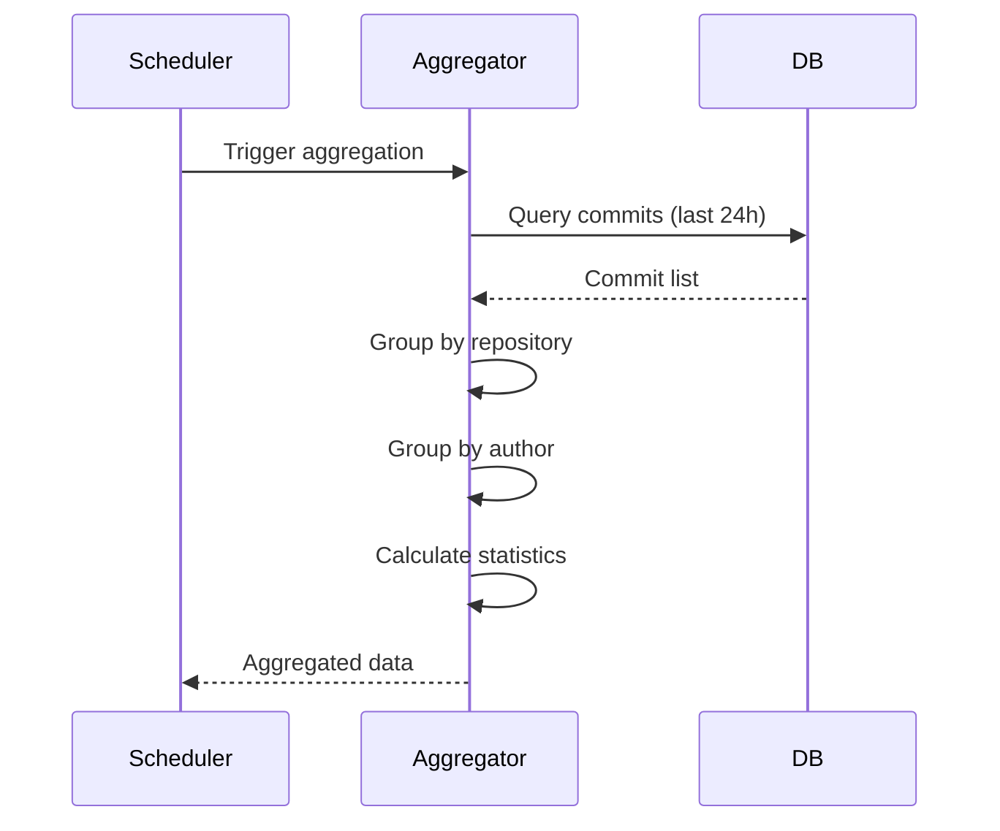
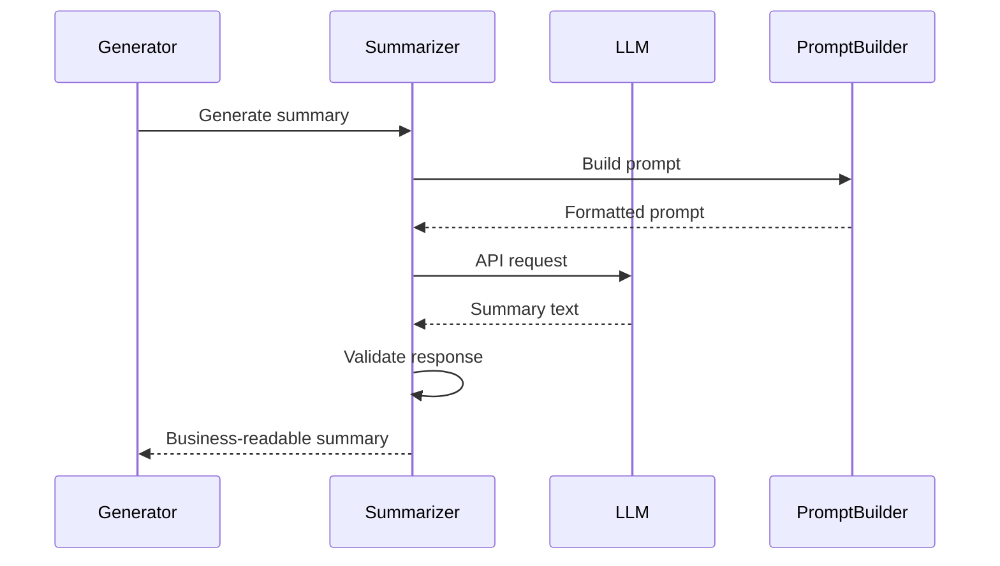
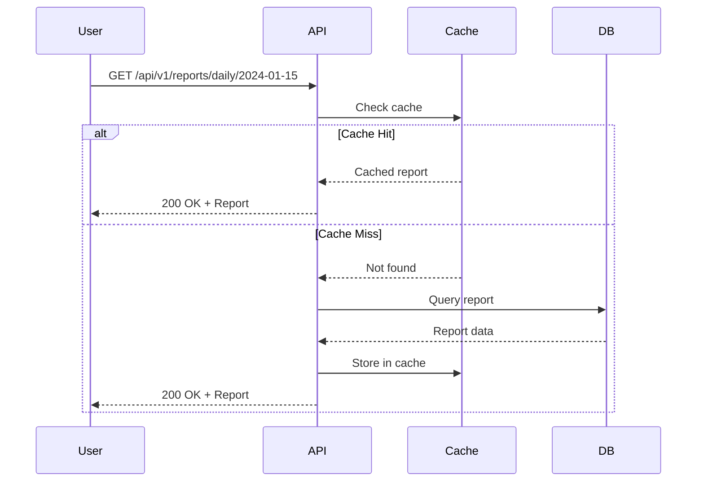

# Cogence Data Flow Documentation

This document describes how data flows through the Cogence system, from collection to report delivery.

---

## Overview

Cogence follows a simple pipeline architecture:

```
Gitea → Collection → Storage → Aggregation → AI Summary → Report → User
```

Each stage is independent and can be tested/debugged separately.

---

## Complete Data Flow Diagram



---

## Stage 1: Data Collection

### Trigger
- **When:** Daily at 6 AM (configurable)
- **How:** APScheduler cron job
- **Frequency:** Once per 24 hours

### Process



### Data Collected

For each commit:
```json
{
  "sha": "abc123def456",
  "repository": "customer-portal",
  "author_name": "John Doe",
  "author_email": "john@example.com",
  "timestamp": "2024-01-15T14:30:00Z",
  "title": "feat(auth): add OAuth2 support",
  "description": "Implemented OAuth2 authentication flow...",
  "files_changed": 8,
  "insertions": 245,
  "deletions": 67
}
```

### Error Handling

```python
try:
    commits = await gitea_client.fetch_commits(repo, since=last_collection)
except GiteaAPIError as e:
    logger.error(f"Failed to fetch from {repo}", extra={
        "repo": repo,
        "error": str(e)
    })
    # Continue with next repository
    continue
except Exception as e:
    logger.critical(f"Unexpected error", extra={"error": str(e)})
    # Alert operations team
    raise
```

---

## Stage 2: Data Storage

### Database Schema

```sql
-- Repositories
CREATE TABLE repositories (
    id SERIAL PRIMARY KEY,
    gitea_id INTEGER UNIQUE NOT NULL,
    name VARCHAR(255) NOT NULL,
    full_name VARCHAR(255) NOT NULL,
    url VARCHAR(512) NOT NULL,
    created_at TIMESTAMP DEFAULT NOW(),
    updated_at TIMESTAMP DEFAULT NOW()
);

-- Commits
CREATE TABLE commits (
    id SERIAL PRIMARY KEY,
    repository_id INTEGER REFERENCES repositories(id),
    sha VARCHAR(40) UNIQUE NOT NULL,
    author_name VARCHAR(255) NOT NULL,
    author_email VARCHAR(255) NOT NULL,
    timestamp TIMESTAMP NOT NULL,
    title VARCHAR(500) NOT NULL,
    description TEXT,
    files_changed INTEGER,
    insertions INTEGER,
    deletions INTEGER,
    created_at TIMESTAMP DEFAULT NOW()
);

CREATE INDEX idx_commits_timestamp ON commits(timestamp);
CREATE INDEX idx_commits_repository ON commits(repository_id);
CREATE INDEX idx_commits_author ON commits(author_name);

-- Collection Metadata
CREATE TABLE collection_runs (
    id SERIAL PRIMARY KEY,
    started_at TIMESTAMP NOT NULL,
    completed_at TIMESTAMP,
    status VARCHAR(50) NOT NULL,
    commits_collected INTEGER,
    errors JSONB,
    created_at TIMESTAMP DEFAULT NOW()
);
```

### Data Validation

Before storage:
1. **SHA uniqueness:** Prevent duplicate commits
2. **Timestamp validity:** Ensure reasonable dates
3. **Required fields:** Verify all required data present
4. **Data types:** Validate field types
5. **Referential integrity:** Ensure repository exists

---

## Stage 3: Data Aggregation

### Trigger
- **When:** After collection completes
- **How:** Scheduled job or manual trigger
- **Input:** Commits from last 24 hours

### Process



### Aggregation Logic

```python
async def aggregate_daily_commits(date: datetime) -> AggregatedData:
    """Aggregate commits for a specific date."""
    
    # Get commits for the day
    commits = await db.get_commits_by_date(date)
    
    # Group by repository
    by_repo = defaultdict(list)
    for commit in commits:
        by_repo[commit.repository].append(commit)
    
    # Group by author
    by_author = defaultdict(list)
    for commit in commits:
        by_author[commit.author_name].append(commit)
    
    # Calculate statistics
    stats = {
        "total_commits": len(commits),
        "total_repositories": len(by_repo),
        "total_contributors": len(by_author),
        "total_files_changed": sum(c.files_changed for c in commits),
        "total_insertions": sum(c.insertions for c in commits),
        "total_deletions": sum(c.deletions for c in commits)
    }
    
    return AggregatedData(
        commits=commits,
        by_repository=by_repo,
        by_author=by_author,
        statistics=stats
    )
```

### Aggregated Data Structure

```json
{
  "date": "2024-01-15",
  "statistics": {
    "total_commits": 15,
    "total_repositories": 3,
    "total_contributors": 5,
    "total_files_changed": 87,
    "total_insertions": 1234,
    "total_deletions": 456
  },
  "by_repository": {
    "customer-portal": [/* commits */],
    "api-gateway": [/* commits */],
    "admin-dashboard": [/* commits */]
  },
  "by_author": {
    "John Doe": [/* commits */],
    "Jane Smith": [/* commits */]
  }
}
```

---

## Stage 4: AI Summary Generation

### Process



### Prompt Template

```python
EXECUTIVE_SUMMARY_PROMPT = """
You are summarizing engineering activity for a non-technical manager.

Context:
- Date: {date}
- Total commits: {total_commits}
- Repositories: {repositories}
- Contributors: {contributors}

Commit details:
{commit_summaries}

Generate a 2-3 sentence executive summary that:
1. Uses business language (no technical jargon)
2. Highlights what was accomplished
3. Identifies key focus areas
4. Is readable by a CEO

Do not mention commit counts, lines of code, or technical metrics.
Focus on business value and project progress.
"""
```

### Example LLM Request/Response

**Request:**
```json
{
  "model": "gpt-4",
  "messages": [
    {
      "role": "system",
      "content": "You summarize engineering work for business leaders."
    },
    {
      "role": "user",
      "content": "Date: 2024-01-15\nCommits: 15\n..."
    }
  ],
  "temperature": 0.7,
  "max_tokens": 200
}
```

**Response:**
```json
{
  "choices": [
    {
      "message": {
        "content": "Engineering focused on customer-facing improvements yesterday. The team enhanced the authentication system and improved user experience in the customer portal. Work also continued on backend performance optimization."
      }
    }
  ]
}
```

---

## Stage 5: Report Generation

### Process

```python
async def generate_daily_report(date: datetime) -> Report:
    """Generate complete daily report."""
    
    # 1. Aggregate data
    aggregated = await aggregate_daily_commits(date)
    
    # 2. Generate executive summary
    exec_summary = await ai_summarizer.generate_summary(aggregated)
    
    # 3. Generate project summaries
    projects = []
    for repo, commits in aggregated.by_repository.items():
        summary = await ai_summarizer.summarize_repository(repo, commits)
        projects.append({
            "repository": repo,
            "commit_count": len(commits),
            "summary": summary
        })
    
    # 4. Generate contributor summaries
    contributors = []
    for author, commits in aggregated.by_author.items():
        summary = await ai_summarizer.summarize_contributor(author, commits)
        contributors.append({
            "name": author,
            "commit_count": len(commits),
            "summary": summary
        })
    
    # 5. Generate management notes
    notes = await ai_summarizer.generate_management_notes(aggregated)
    
    # 6. Create report
    report = Report(
        report_date=date,
        executive_summary=exec_summary,
        projects=projects,
        contributors=contributors,
        management_notes=notes,
        metadata={
            "generated_at": datetime.now(),
            "total_commits": aggregated.statistics["total_commits"]
        }
    )
    
    # 7. Store report
    await db.store_report(report)
    
    return report
```

### Report Structure

```json
{
  "report_date": "2024-01-15",
  "report_type": "daily",
  "executive_summary": "Engineering focused on customer-facing improvements...",
  "projects": [
    {
      "repository": "customer-portal",
      "commit_count": 8,
      "summary": "Authentication improvements and UI enhancements"
    },
    {
      "repository": "api-gateway",
      "commit_count": 5,
      "summary": "Performance optimization and error handling"
    }
  ],
  "contributors": [
    {
      "name": "John Doe",
      "commit_count": 6,
      "summary": "Worked on authentication system and user management"
    },
    {
      "name": "Jane Smith",
      "commit_count": 4,
      "summary": "Improved API performance and added monitoring"
    }
  ],
  "management_notes": "High activity on customer-facing projects. No unusual patterns detected.",
  "metadata": {
    "generated_at": "2024-01-16T00:30:00Z",
    "total_commits": 15,
    "generation_duration_ms": 2340
  }
}
```

---

## Stage 6: Report Delivery

### API Endpoint

```python
@router.get("/api/v1/reports/daily/{date}")
async def get_daily_report(
    date: str,
    db: AsyncSession = Depends(get_db)
) -> Report:
    """Get daily report for specific date."""
    
    # Parse date
    report_date = datetime.strptime(date, "%Y-%m-%d")
    
    # Check cache
    cached = await cache.get(f"report:{date}")
    if cached:
        return cached
    
    # Query database
    report = await db.get_report_by_date(report_date)
    if not report:
        raise HTTPException(404, "Report not found")
    
    # Cache for future requests
    await cache.set(f"report:{date}", report, ttl=3600)
    
    return report
```

### Response Flow



---

## Error Handling Throughout Pipeline

### Collection Errors

```python
# Transient errors: Retry
try:
    commits = await gitea_client.fetch_commits(repo)
except httpx.TimeoutError:
    await asyncio.sleep(5)
    commits = await gitea_client.fetch_commits(repo)  # Retry

# Permanent errors: Skip and log
except GiteaAPIError as e:
    logger.error(f"Skipping {repo}: {e}")
    continue

# Critical errors: Alert and fail
except Exception as e:
    logger.critical(f"Critical error: {e}")
    await alert_operations_team(e)
    raise
```

### Generation Errors

```python
# LLM errors: Use fallback
try:
    summary = await llm.generate_summary(data)
except LLMAPIError:
    summary = generate_template_summary(data)  # Fallback

# Data errors: Generate partial report
except DataValidationError as e:
    logger.warning(f"Invalid data: {e}")
    report = generate_partial_report(valid_data)
```

---

## Performance Considerations

### Collection Performance
- **Parallel fetching:** Fetch multiple repositories concurrently
- **Batch processing:** Process commits in batches
- **Connection pooling:** Reuse HTTP connections

### Generation Performance
- **Caching:** Cache generated reports
- **Async processing:** Generate sections concurrently
- **LLM optimization:** Batch LLM requests when possible

### API Performance
- **Response caching:** Cache report responses
- **Database indexing:** Index frequently queried fields
- **Connection pooling:** Reuse database connections

---

## Monitoring Points

### Collection Monitoring
- Collection duration
- Commits collected per run
- API errors and retries
- Failed repositories

### Generation Monitoring
- Report generation duration
- LLM API latency
- Generation failures
- Cache hit rate

### API Monitoring
- Request latency
- Error rates
- Cache hit rate
- Concurrent requests

---

## Data Retention

### Commit Data
- **Retention:** 90+ days
- **Archival:** Move to cold storage after 90 days
- **Deletion:** Never delete without explicit action

### Reports
- **Retention:** Indefinite
- **Storage:** PostgreSQL (hot), S3 (cold)
- **Access:** Recent reports in database, older in archive

### Logs
- **Application logs:** 30 days
- **Access logs:** 90 days
- **Error logs:** 1 year

---

## Related Documentation

- [System Overview](system-overview.md)
- [Database Schema](database.md)
- [API Documentation](../api/README.md)
- [Requirements](../product/requirements.md)

---

**Last Updated:** 2026-06-17