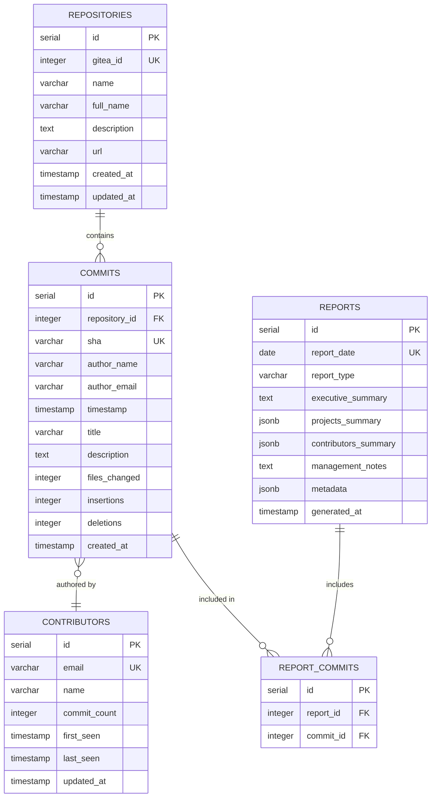

# Cogence Data Model

## Overview

This document defines the physical data model for Cogence, including database schema, relationships, indexes, and constraints. The data model implements the [Domain Model](domain-model.md) using PostgreSQL.

---

## Database Schema

### Entity Relationship Diagram



---

## Table Definitions

### repositories

Stores Git repository metadata.

```sql
CREATE TABLE repositories (
    id SERIAL PRIMARY KEY,
    gitea_id INTEGER UNIQUE NOT NULL,
    name VARCHAR(255) NOT NULL,
    full_name VARCHAR(255) NOT NULL,
    description TEXT,
    url VARCHAR(512) NOT NULL,
    created_at TIMESTAMP NOT NULL DEFAULT NOW(),
    updated_at TIMESTAMP NOT NULL DEFAULT NOW(),
    
    CONSTRAINT repositories_gitea_id_unique UNIQUE (gitea_id),
    CONSTRAINT repositories_name_not_empty CHECK (LENGTH(name) > 0),
    CONSTRAINT repositories_url_not_empty CHECK (LENGTH(url) > 0)
);

-- Indexes
CREATE INDEX idx_repositories_name ON repositories(name);
CREATE INDEX idx_repositories_full_name ON repositories(full_name);
CREATE INDEX idx_repositories_updated_at ON repositories(updated_at DESC);

-- Comments
COMMENT ON TABLE repositories IS 'Git repositories being tracked';
COMMENT ON COLUMN repositories.gitea_id IS 'External Gitea repository ID';
COMMENT ON COLUMN repositories.full_name IS 'Full repository name (org/repo)';
```

**Columns:**

| Column | Type | Nullable | Default | Description |
|--------|------|----------|---------|-------------|
| id | SERIAL | NO | - | Primary key |
| gitea_id | INTEGER | NO | - | Gitea repository ID (unique) |
| name | VARCHAR(255) | NO | - | Repository name |
| full_name | VARCHAR(255) | NO | - | Full name (org/repo) |
| description | TEXT | YES | NULL | Repository description |
| url | VARCHAR(512) | NO | - | Repository URL |
| created_at | TIMESTAMP | NO | NOW() | Record creation time |
| updated_at | TIMESTAMP | NO | NOW() | Last update time |

**Constraints:**
- Primary Key: `id`
- Unique: `gitea_id`
- Check: `name` not empty
- Check: `url` not empty

**Indexes:**
- `idx_repositories_name` on `name`
- `idx_repositories_full_name` on `full_name`
- `idx_repositories_updated_at` on `updated_at DESC`

---

### commits

Stores Git commit metadata.

```sql
CREATE TABLE commits (
    id SERIAL PRIMARY KEY,
    repository_id INTEGER NOT NULL REFERENCES repositories(id) ON DELETE RESTRICT,
    sha VARCHAR(40) UNIQUE NOT NULL,
    author_name VARCHAR(255) NOT NULL,
    author_email VARCHAR(255) NOT NULL,
    timestamp TIMESTAMP NOT NULL,
    title VARCHAR(500) NOT NULL,
    description TEXT,
    files_changed INTEGER DEFAULT 0,
    insertions INTEGER DEFAULT 0,
    deletions INTEGER DEFAULT 0,
    created_at TIMESTAMP NOT NULL DEFAULT NOW(),
    
    CONSTRAINT commits_sha_unique UNIQUE (sha),
    CONSTRAINT commits_sha_format CHECK (sha ~ '^[a-f0-9]{40}$'),
    CONSTRAINT commits_title_not_empty CHECK (LENGTH(title) > 0),
    CONSTRAINT commits_author_name_not_empty CHECK (LENGTH(author_name) > 0),
    CONSTRAINT commits_author_email_format CHECK (author_email ~ '^[^@]+@[^@]+\.[^@]+$'),
    CONSTRAINT commits_files_changed_non_negative CHECK (files_changed >= 0),
    CONSTRAINT commits_insertions_non_negative CHECK (insertions >= 0),
    CONSTRAINT commits_deletions_non_negative CHECK (deletions >= 0)
);

-- Indexes
CREATE INDEX idx_commits_repository_id ON commits(repository_id);
CREATE INDEX idx_commits_timestamp ON commits(timestamp DESC);
CREATE INDEX idx_commits_author_email ON commits(author_email);
CREATE INDEX idx_commits_author_name ON commits(author_name);
CREATE INDEX idx_commits_created_at ON commits(created_at DESC);
CREATE INDEX idx_commits_repo_timestamp ON commits(repository_id, timestamp DESC);

-- Comments
COMMENT ON TABLE commits IS 'Git commits with metadata';
COMMENT ON COLUMN commits.sha IS 'Git commit SHA (40 character hex)';
COMMENT ON COLUMN commits.timestamp IS 'Commit timestamp from Git';
COMMENT ON COLUMN commits.created_at IS 'When commit was collected';
```

**Columns:**

| Column | Type | Nullable | Default | Description |
|--------|------|----------|---------|-------------|
| id | SERIAL | NO | - | Primary key |
| repository_id | INTEGER | NO | - | Foreign key to repositories |
| sha | VARCHAR(40) | NO | - | Git commit SHA (unique) |
| author_name | VARCHAR(255) | NO | - | Commit author name |
| author_email | VARCHAR(255) | NO | - | Commit author email |
| timestamp | TIMESTAMP | NO | - | Commit timestamp |
| title | VARCHAR(500) | NO | - | Commit message title |
| description | TEXT | YES | NULL | Commit message body |
| files_changed | INTEGER | YES | 0 | Number of files changed |
| insertions | INTEGER | YES | 0 | Lines added |
| deletions | INTEGER | YES | 0 | Lines deleted |
| created_at | TIMESTAMP | NO | NOW() | Collection timestamp |

**Constraints:**
- Primary Key: `id`
- Foreign Key: `repository_id` → `repositories(id)` ON DELETE RESTRICT
- Unique: `sha`
- Check: `sha` format (40 hex characters)
- Check: `title` not empty
- Check: `author_name` not empty
- Check: `author_email` format (basic email validation)
- Check: `files_changed` >= 0
- Check: `insertions` >= 0
- Check: `deletions` >= 0

**Indexes:**
- `idx_commits_repository_id` on `repository_id`
- `idx_commits_timestamp` on `timestamp DESC`
- `idx_commits_author_email` on `author_email`
- `idx_commits_author_name` on `author_name`
- `idx_commits_created_at` on `created_at DESC`
- `idx_commits_repo_timestamp` on `(repository_id, timestamp DESC)` (composite)

---

### contributors

Stores aggregated contributor information (materialized view or table).

```sql
CREATE TABLE contributors (
    id SERIAL PRIMARY KEY,
    email VARCHAR(255) UNIQUE NOT NULL,
    name VARCHAR(255) NOT NULL,
    commit_count INTEGER NOT NULL DEFAULT 0,
    first_seen TIMESTAMP NOT NULL,
    last_seen TIMESTAMP NOT NULL,
    updated_at TIMESTAMP NOT NULL DEFAULT NOW(),
    
    CONSTRAINT contributors_email_unique UNIQUE (email),
    CONSTRAINT contributors_email_format CHECK (email ~ '^[^@]+@[^@]+\.[^@]+$'),
    CONSTRAINT contributors_name_not_empty CHECK (LENGTH(name) > 0),
    CONSTRAINT contributors_commit_count_non_negative CHECK (commit_count >= 0),
    CONSTRAINT contributors_dates_valid CHECK (last_seen >= first_seen)
);

-- Indexes
CREATE INDEX idx_contributors_name ON contributors(name);
CREATE INDEX idx_contributors_last_seen ON contributors(last_seen DESC);
CREATE INDEX idx_contributors_commit_count ON contributors(commit_count DESC);

-- Comments
COMMENT ON TABLE contributors IS 'Aggregated contributor information';
COMMENT ON COLUMN contributors.email IS 'Primary identifier for contributor';
COMMENT ON COLUMN contributors.name IS 'Most recent name used';
COMMENT ON COLUMN contributors.commit_count IS 'Total commits by this contributor';
```

**Columns:**

| Column | Type | Nullable | Default | Description |
|--------|------|----------|---------|-------------|
| id | SERIAL | NO | - | Primary key |
| email | VARCHAR(255) | NO | - | Contributor email (unique) |
| name | VARCHAR(255) | NO | - | Contributor name |
| commit_count | INTEGER | NO | 0 | Total commit count |
| first_seen | TIMESTAMP | NO | - | First commit timestamp |
| last_seen | TIMESTAMP | NO | - | Last commit timestamp |
| updated_at | TIMESTAMP | NO | NOW() | Last update time |

**Constraints:**
- Primary Key: `id`
- Unique: `email`
- Check: `email` format
- Check: `name` not empty
- Check: `commit_count` >= 0
- Check: `last_seen` >= `first_seen`

**Indexes:**
- `idx_contributors_name` on `name`
- `idx_contributors_last_seen` on `last_seen DESC`
- `idx_contributors_commit_count` on `commit_count DESC`

---

### reports

Stores generated daily reports.

```sql
CREATE TABLE reports (
    id SERIAL PRIMARY KEY,
    report_date DATE UNIQUE NOT NULL,
    report_type VARCHAR(50) NOT NULL DEFAULT 'daily',
    executive_summary TEXT NOT NULL,
    projects_summary JSONB NOT NULL,
    contributors_summary JSONB NOT NULL,
    management_notes TEXT,
    metadata JSONB,
    generated_at TIMESTAMP NOT NULL DEFAULT NOW(),
    
    CONSTRAINT reports_date_unique UNIQUE (report_date),
    CONSTRAINT reports_type_valid CHECK (report_type IN ('daily')),
    CONSTRAINT reports_executive_summary_not_empty CHECK (LENGTH(executive_summary) > 0),
    CONSTRAINT reports_projects_summary_not_null CHECK (projects_summary IS NOT NULL),
    CONSTRAINT reports_contributors_summary_not_null CHECK (contributors_summary IS NOT NULL)
);

-- Indexes
CREATE INDEX idx_reports_date ON reports(report_date DESC);
CREATE INDEX idx_reports_type ON reports(report_type);
CREATE INDEX idx_reports_generated_at ON reports(generated_at DESC);
CREATE INDEX idx_reports_projects_summary ON reports USING GIN (projects_summary);
CREATE INDEX idx_reports_contributors_summary ON reports USING GIN (contributors_summary);

-- Comments
COMMENT ON TABLE reports IS 'Generated daily engineering reports';
COMMENT ON COLUMN reports.report_date IS 'Date of the report (unique)';
COMMENT ON COLUMN reports.projects_summary IS 'JSON array of project summaries';
COMMENT ON COLUMN reports.contributors_summary IS 'JSON array of contributor summaries';
COMMENT ON COLUMN reports.metadata IS 'Generation metadata (duration, counts, etc.)';
```

**Columns:**

| Column | Type | Nullable | Default | Description |
|--------|------|----------|---------|-------------|
| id | SERIAL | NO | - | Primary key |
| report_date | DATE | NO | - | Report date (unique) |
| report_type | VARCHAR(50) | NO | 'daily' | Report type |
| executive_summary | TEXT | NO | - | Executive summary text |
| projects_summary | JSONB | NO | - | Project summaries (JSON) |
| contributors_summary | JSONB | NO | - | Contributor summaries (JSON) |
| management_notes | TEXT | YES | NULL | Management notes |
| metadata | JSONB | YES | NULL | Generation metadata |
| generated_at | TIMESTAMP | NO | NOW() | Generation timestamp |

**Constraints:**
- Primary Key: `id`
- Unique: `report_date`
- Check: `report_type` IN ('daily')
- Check: `executive_summary` not empty
- Check: `projects_summary` not null
- Check: `contributors_summary` not null

**Indexes:**
- `idx_reports_date` on `report_date DESC`
- `idx_reports_type` on `report_type`
- `idx_reports_generated_at` on `generated_at DESC`
- `idx_reports_projects_summary` on `projects_summary` (GIN index for JSONB)
- `idx_reports_contributors_summary` on `contributors_summary` (GIN index for JSONB)

---

### report_commits

Junction table linking reports to commits.

```sql
CREATE TABLE report_commits (
    id SERIAL PRIMARY KEY,
    report_id INTEGER NOT NULL REFERENCES reports(id) ON DELETE CASCADE,
    commit_id INTEGER NOT NULL REFERENCES commits(id) ON DELETE CASCADE,
    
    CONSTRAINT report_commits_unique UNIQUE (report_id, commit_id)
);

-- Indexes
CREATE INDEX idx_report_commits_report_id ON report_commits(report_id);
CREATE INDEX idx_report_commits_commit_id ON report_commits(commit_id);

-- Comments
COMMENT ON TABLE report_commits IS 'Links reports to commits they include';
```

**Columns:**

| Column | Type | Nullable | Default | Description |
|--------|------|----------|---------|-------------|
| id | SERIAL | NO | - | Primary key |
| report_id | INTEGER | NO | - | Foreign key to reports |
| commit_id | INTEGER | NO | - | Foreign key to commits |

**Constraints:**
- Primary Key: `id`
- Foreign Key: `report_id` → `reports(id)` ON DELETE CASCADE
- Foreign Key: `commit_id` → `commits(id)` ON DELETE CASCADE
- Unique: `(report_id, commit_id)`

**Indexes:**
- `idx_report_commits_report_id` on `report_id`
- `idx_report_commits_commit_id` on `commit_id`

---

## JSON Schema Definitions

### projects_summary JSONB Structure

```json
[
  {
    "repository": "customer-portal",
    "repository_id": 1,
    "commit_count": 8,
    "summary": "Authentication improvements and user experience enhancements",
    "contributors": ["john@example.com", "jane@example.com"]
  }
]
```

**Schema:**
```json
{
  "type": "array",
  "items": {
    "type": "object",
    "required": ["repository", "repository_id", "commit_count", "summary"],
    "properties": {
      "repository": {"type": "string"},
      "repository_id": {"type": "integer"},
      "commit_count": {"type": "integer", "minimum": 1},
      "summary": {"type": "string", "minLength": 1},
      "contributors": {
        "type": "array",
        "items": {"type": "string", "format": "email"}
      }
    }
  }
}
```

---

### contributors_summary JSONB Structure

```json
[
  {
    "name": "John Doe",
    "email": "john@example.com",
    "commit_count": 6,
    "summary": "Worked on authentication system and user management features",
    "repositories": ["customer-portal", "api-gateway"]
  }
]
```

**Schema:**
```json
{
  "type": "array",
  "items": {
    "type": "object",
    "required": ["name", "email", "commit_count", "summary"],
    "properties": {
      "name": {"type": "string"},
      "email": {"type": "string", "format": "email"},
      "commit_count": {"type": "integer", "minimum": 1},
      "summary": {"type": "string", "minLength": 1},
      "repositories": {
        "type": "array",
        "items": {"type": "string"}
      }
    }
  }
}
```

---

### metadata JSONB Structure

```json
{
  "generated_at": "2024-01-16T00:30:00Z",
  "total_commits": 15,
  "total_repositories": 3,
  "total_contributors": 4,
  "generation_duration_ms": 2340,
  "llm_model": "gpt-4",
  "llm_tokens": 1250
}
```

**Schema:**
```json
{
  "type": "object",
  "properties": {
    "generated_at": {"type": "string", "format": "date-time"},
    "total_commits": {"type": "integer", "minimum": 0},
    "total_repositories": {"type": "integer", "minimum": 0},
    "total_contributors": {"type": "integer", "minimum": 0},
    "generation_duration_ms": {"type": "integer", "minimum": 0},
    "llm_model": {"type": "string"},
    "llm_tokens": {"type": "integer", "minimum": 0}
  }
}
```

---

## Views

### v_repository_stats

Aggregated repository statistics.

```sql
CREATE VIEW v_repository_stats AS
SELECT 
    r.id,
    r.name,
    r.full_name,
    COUNT(c.id) AS total_commits,
    COUNT(DISTINCT c.author_email) AS contributor_count,
    MIN(c.timestamp) AS first_commit,
    MAX(c.timestamp) AS last_commit,
    SUM(c.files_changed) AS total_files_changed,
    SUM(c.insertions) AS total_insertions,
    SUM(c.deletions) AS total_deletions
FROM repositories r
LEFT JOIN commits c ON r.id = c.repository_id
GROUP BY r.id, r.name, r.full_name;

COMMENT ON VIEW v_repository_stats IS 'Aggregated repository statistics';
```

---

### v_contributor_activity

Recent contributor activity.

```sql
CREATE VIEW v_contributor_activity AS
SELECT 
    c.author_email,
    c.author_name,
    COUNT(c.id) AS commit_count,
    COUNT(DISTINCT c.repository_id) AS repository_count,
    MIN(c.timestamp) AS first_commit,
    MAX(c.timestamp) AS last_commit,
    SUM(c.files_changed) AS total_files_changed
FROM commits c
WHERE c.timestamp >= NOW() - INTERVAL '30 days'
GROUP BY c.author_email, c.author_name;

COMMENT ON VIEW v_contributor_activity IS 'Contributor activity in last 30 days';
```

---

### v_daily_activity

Daily commit activity summary.

```sql
CREATE VIEW v_daily_activity AS
SELECT 
    DATE(c.timestamp) AS activity_date,
    COUNT(c.id) AS commit_count,
    COUNT(DISTINCT c.repository_id) AS repository_count,
    COUNT(DISTINCT c.author_email) AS contributor_count,
    SUM(c.files_changed) AS total_files_changed,
    SUM(c.insertions) AS total_insertions,
    SUM(c.deletions) AS total_deletions
FROM commits c
GROUP BY DATE(c.timestamp)
ORDER BY activity_date DESC;

COMMENT ON VIEW v_daily_activity IS 'Daily commit activity summary';
```

---

## Triggers

### update_repository_timestamp

Update repository `updated_at` when commits are added.

```sql
CREATE OR REPLACE FUNCTION update_repository_timestamp()
RETURNS TRIGGER AS $$
BEGIN
    UPDATE repositories
    SET updated_at = NOW()
    WHERE id = NEW.repository_id;
    RETURN NEW;
END;
$$ LANGUAGE plpgsql;

CREATE TRIGGER trigger_update_repository_timestamp
AFTER INSERT ON commits
FOR EACH ROW
EXECUTE FUNCTION update_repository_timestamp();
```

---

### update_contributor_stats

Update contributor statistics when commits are added.

```sql
CREATE OR REPLACE FUNCTION update_contributor_stats()
RETURNS TRIGGER AS $$
BEGIN
    INSERT INTO contributors (email, name, commit_count, first_seen, last_seen)
    VALUES (NEW.author_email, NEW.author_name, 1, NEW.timestamp, NEW.timestamp)
    ON CONFLICT (email) DO UPDATE
    SET 
        name = NEW.author_name,
        commit_count = contributors.commit_count + 1,
        last_seen = GREATEST(contributors.last_seen, NEW.timestamp),
        updated_at = NOW();
    RETURN NEW;
END;
$$ LANGUAGE plpgsql;

CREATE TRIGGER trigger_update_contributor_stats
AFTER INSERT ON commits
FOR EACH ROW
EXECUTE FUNCTION update_contributor_stats();
```

---

## Indexes Strategy

### Query Patterns

1. **Get commits by date range:** `idx_commits_timestamp`
2. **Get commits by repository:** `idx_commits_repository_id`
3. **Get commits by author:** `idx_commits_author_email`
4. **Get repository commits by date:** `idx_commits_repo_timestamp` (composite)
5. **Get latest report:** `idx_reports_date`
6. **Search in JSON summaries:** GIN indexes on JSONB columns

### Index Maintenance

- Analyze tables weekly
- Reindex monthly
- Monitor index usage with `pg_stat_user_indexes`
- Drop unused indexes

---

## Data Retention

### Retention Policies

1. **Commits:** Retain indefinitely (system of record)
2. **Reports:** Retain for 90 days minimum
3. **Contributors:** Retain while commits exist
4. **Repositories:** Retain while commits exist

### Archival Strategy

```sql
-- Archive old reports (future)
CREATE TABLE reports_archive (
    LIKE reports INCLUDING ALL
);

-- Move reports older than 1 year
INSERT INTO reports_archive
SELECT * FROM reports
WHERE report_date < NOW() - INTERVAL '1 year';

DELETE FROM reports
WHERE report_date < NOW() - INTERVAL '1 year';
```

---

## Performance Considerations

### Query Optimization

1. **Use indexes effectively:** Ensure WHERE clauses use indexed columns
2. **Limit result sets:** Use LIMIT and OFFSET for pagination
3. **Avoid SELECT *:** Select only needed columns
4. **Use EXPLAIN ANALYZE:** Profile slow queries

### Connection Pooling

- Use connection pooling (asyncpg pool)
- Pool size: 10-20 connections
- Max overflow: 10 connections
- Connection timeout: 30 seconds

### Caching Strategy

1. **Application-level caching:** Cache generated reports
2. **Database-level caching:** PostgreSQL query cache
3. **Materialized views:** For expensive aggregations (future)

---

## Backup and Recovery

### Backup Strategy

1. **Full backup:** Daily at 2 AM
2. **Incremental backup:** Every 6 hours
3. **WAL archiving:** Continuous
4. **Retention:** 30 days

### Recovery Procedures

```bash
# Point-in-time recovery
pg_restore -d cogence backup_file.dump

# WAL replay
pg_waldump wal_file
```

---

## Migration Strategy

### Alembic Migrations

```python
# Example migration
def upgrade():
    op.create_table(
        'repositories',
        sa.Column('id', sa.Integer(), nullable=False),
        sa.Column('gitea_id', sa.Integer(), nullable=False),
        sa.Column('name', sa.String(255), nullable=False),
        # ... other columns
        sa.PrimaryKeyConstraint('id'),
        sa.UniqueConstraint('gitea_id')
    )

def downgrade():
    op.drop_table('repositories')
```

### Migration Best Practices

1. **Test migrations:** Test on staging before production
2. **Backup before migration:** Always backup before running migrations
3. **Reversible migrations:** Implement downgrade functions
4. **Data migrations:** Separate schema and data migrations
5. **Version control:** Track all migrations in Git

---

## Security

### Access Control

```sql
-- Create application user
CREATE USER cogence_app WITH PASSWORD 'secure_password';

-- Grant necessary permissions
GRANT CONNECT ON DATABASE cogence TO cogence_app;
GRANT USAGE ON SCHEMA public TO cogence_app;
GRANT SELECT, INSERT, UPDATE ON ALL TABLES IN SCHEMA public TO cogence_app;
GRANT USAGE, SELECT ON ALL SEQUENCES IN SCHEMA public TO cogence_app;

-- Revoke dangerous permissions
REVOKE DELETE ON ALL TABLES IN SCHEMA public FROM cogence_app;
```

### Encryption

- **At rest:** PostgreSQL encryption (pgcrypto)
- **In transit:** SSL/TLS connections required
- **Sensitive data:** Encrypt tokens and credentials

---

## Related Documentation

- [Domain Model](domain-model.md)
- [System Architecture](system-overview.md)
- [Database Architecture](database.md)
- [API Documentation](../api/README.md)

---

**Last Updated:** 2026-06-17

**Version:** 1.0.0