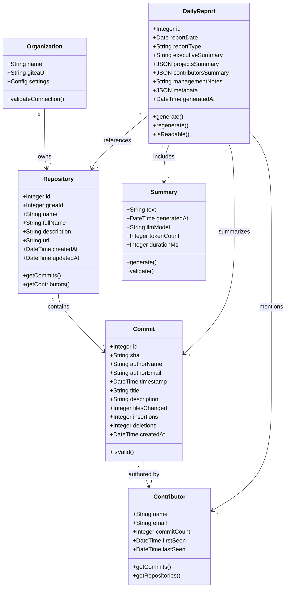
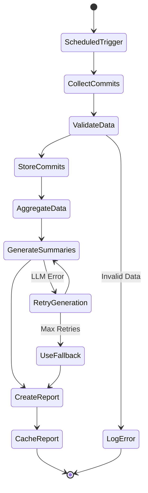
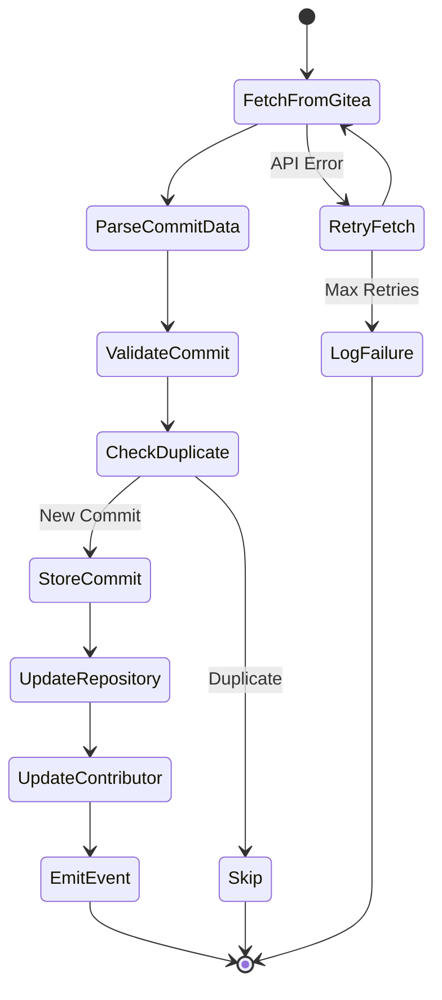

# Cogence Domain Model

## Overview

This document defines the core domain entities, their relationships, and business rules for Cogence. The domain model represents the business concepts and logic independent of technical implementation.

---

## Domain Entities

### Organization

Represents the company or organization using Cogence.

**Attributes:**
- Name
- Gitea URL
- Configuration settings

**Responsibilities:**
- Owns repositories
- Defines access policies
- Configures report preferences

**Business Rules:**
- Single-tenant in MVP v1
- Must have valid Gitea connection
- Configuration validated on startup

---

### Repository

Represents a Git repository being tracked.

**Attributes:**
- ID (internal)
- Gitea ID (external)
- Name
- Full name (org/repo)
- Description
- URL
- Created timestamp
- Last updated timestamp

**Relationships:**
- Belongs to Organization
- Contains many Commits
- Has many Contributors (through Commits)

**Responsibilities:**
- Stores repository metadata
- Tracks commit history
- Provides repository context

**Business Rules:**
- Must have unique Gitea ID
- Name must be valid Git repository name
- URL must be accessible
- Cannot be deleted if commits exist

---

### Commit

Represents a single Git commit with metadata.

**Attributes:**
- ID (internal)
- SHA (Git commit hash)
- Repository reference
- Author name
- Author email
- Timestamp
- Message title
- Message description
- Files changed count
- Lines added (insertions)
- Lines deleted (deletions)
- Created timestamp

**Relationships:**
- Belongs to Repository
- Authored by Contributor
- Included in DailyReport

**Responsibilities:**
- Stores commit metadata
- Provides commit details
- Enables activity tracking

**Business Rules:**
- SHA must be unique across system
- Timestamp must be valid ISO 8601
- Author information required
- Message title required (description optional)
- Cannot be modified after creation
- Cannot be deleted (immutable)

---

### Contributor

Represents a person who makes commits (derived entity).

**Attributes:**
- Name
- Email
- Commit count
- First seen timestamp
- Last seen timestamp

**Relationships:**
- Authors many Commits
- Contributes to many Repositories
- Appears in many DailyReports

**Responsibilities:**
- Aggregates author information
- Tracks contributor activity
- Provides contributor context

**Business Rules:**
- Identified by email address
- Name may vary across commits (use most recent)
- No personal metrics or scoring (ADR-004)
- Privacy-respecting aggregation only

---

### DailyReport

Represents a generated daily engineering report.

**Attributes:**
- ID
- Report date
- Report type (always "daily" in MVP)
- Executive summary
- Projects summary (structured)
- Contributors summary (structured)
- Management notes
- Metadata (generation info)
- Generated timestamp

**Relationships:**
- Summarizes many Commits
- References many Repositories
- Mentions many Contributors

**Responsibilities:**
- Aggregates daily activity
- Provides business-readable summary
- Delivers actionable insights

**Business Rules:**
- One report per date
- Must include all sections
- Generated from commits in 24-hour window
- Cached after generation
- Can be regenerated if needed
- Readable in under 60 seconds (ADR-007)

---

### Summary

Represents AI-generated business-readable text (value object).

**Attributes:**
- Text content
- Generation timestamp
- LLM model used
- Token count
- Generation duration

**Relationships:**
- Part of DailyReport
- Generated from Commits

**Responsibilities:**
- Provides human-readable summary
- Translates technical to business language
- Highlights key information

**Business Rules:**
- Must use business language (ADR-002)
- No technical jargon
- Concise and actionable
- Generated by AI (ADR-005)
- No code analysis (ADR-003)

---

## Domain Relationships

---

## Aggregates

### Repository Aggregate

**Root:** Repository  
**Entities:** Commit  
**Value Objects:** CommitMetadata

**Boundaries:**
- Repository is the aggregate root
- Commits are accessed through Repository
- Commit lifecycle managed by Repository

**Invariants:**
- All commits must belong to a repository
- Repository cannot be deleted with commits
- Commit SHAs unique within repository

---

### Report Aggregate

**Root:** DailyReport  
**Entities:** None (references other aggregates)  
**Value Objects:** Summary, ProjectSummary, ContributorSummary

**Boundaries:**
- DailyReport is the aggregate root
- Summaries are part of the report
- References commits but doesn't own them

**Invariants:**
- One report per date
- All sections must be present
- Report immutable after generation (except regeneration)

---

## Domain Services

### CommitCollectionService

**Responsibilities:**
- Fetch commits from Gitea
- Validate commit data
- Store commits in repository
- Handle collection errors

**Operations:**
- `collectCommits(repository, since, until)`
- `validateCommit(commitData)`
- `storeCommit(commit)`

---

### ReportGenerationService

**Responsibilities:**
- Aggregate commits for date range
- Generate summaries using LLM
- Create structured report
- Store report

**Operations:**
- `generateDailyReport(date)`
- `aggregateCommits(date)`
- `generateSummary(commits)`
- `createReport(date, summaries)`

---

### SummaryGenerationService

**Responsibilities:**
- Transform commits to business language
- Generate executive summary
- Create project summaries
- Create contributor summaries
- Generate management notes

**Operations:**
- `generateExecutiveSummary(commits)`
- `generateProjectSummary(repository, commits)`
- `generateContributorSummary(contributor, commits)`
- `generateManagementNotes(commits, patterns)`

---

## Domain Events

### CommitCollected

Raised when a new commit is collected.

**Attributes:**
- Commit ID
- Repository ID
- Timestamp
- Author

**Handlers:**
- Update repository last activity
- Update contributor statistics
- Trigger report regeneration (if needed)

---

### ReportGenerated

Raised when a daily report is generated.

**Attributes:**
- Report ID
- Report date
- Generation timestamp
- Commit count

**Handlers:**
- Cache report
- Send notifications (future)
- Update metrics

---

### CollectionFailed

Raised when commit collection fails.

**Attributes:**
- Repository ID
- Error message
- Timestamp
- Retry count

**Handlers:**
- Log error
- Alert operators
- Schedule retry

---

## Business Rules

### Commit Collection Rules

1. **Uniqueness:** Commits identified by SHA, no duplicates
2. **Immutability:** Commits never modified after creation
3. **Completeness:** All required metadata must be present
4. **Timeliness:** Collect commits within 24 hours
5. **Reliability:** Retry failed collections with backoff

---

### Report Generation Rules

1. **Daily Cadence:** One report per day (ADR-006)
2. **Business Language:** No technical jargon (ADR-002)
3. **Readability:** Under 60 seconds to read (ADR-007)
4. **Accuracy:** Based on commits only (ADR-001)
5. **Privacy:** No individual scoring (ADR-004)
6. **Actionability:** Include management recommendations
7. **Completeness:** All sections required
8. **Caching:** Cache after generation

---

### Summary Generation Rules

1. **AI-Generated:** Use LLM for summaries (ADR-005)
2. **Context-Aware:** Consider repository and project context
3. **Concise:** 2-4 sentences for executive summary
4. **Factual:** Based on commit data only
5. **No Invention:** Don't create repositories or contributors
6. **No Code Analysis:** Don't analyze code (ADR-003)
7. **Business Focus:** Translate technical to business terms

---

## Value Objects

### CommitMetadata

**Attributes:**
- Files changed
- Insertions
- Deletions
- Timestamp

**Invariants:**
- Counts must be non-negative
- Timestamp must be valid

---

### ProjectSummary

**Attributes:**
- Repository name
- Commit count
- Summary text

**Invariants:**
- Repository must exist
- Commit count must match actual commits
- Summary must be non-empty

---

### ContributorSummary

**Attributes:**
- Contributor name
- Commit count
- Summary text

**Invariants:**
- Contributor must exist
- Commit count must match actual commits
- Summary must be non-empty
- No scoring or ranking

---

### ReportMetadata

**Attributes:**
- Generated timestamp
- Total commits
- Total repositories
- Total contributors
- Generation duration
- LLM model used

**Invariants:**
- All counts must be non-negative
- Duration must be positive
- Timestamp must be valid

---

## Domain Invariants

### System-Wide Invariants

1. **Data Integrity:** All foreign keys must reference valid entities
2. **Temporal Consistency:** Timestamps must be chronologically valid
3. **Uniqueness:** Primary identifiers must be unique
4. **Completeness:** Required fields must be present
5. **Immutability:** Historical data cannot be modified

---

### Business Invariants

1. **Single Tenant:** One organization per deployment (ADR-008)
2. **Commit Source:** Commits from Gitea only (MVP scope)
3. **Daily Reports:** Only daily report type in MVP (ADR-006)
4. **No Surveillance:** No individual productivity metrics (ADR-004)
5. **Business Language:** All reports use business terminology (ADR-002)

---

## Domain Workflows

### Daily Report Generation Workflow

---

### Commit Collection Workflow

---

## Ubiquitous Language

### Core Terms

- **Commit:** A Git commit with metadata (not "change" or "update")
- **Repository:** A Git repository (not "project" or "codebase")
- **Contributor:** A person who authors commits (not "developer" or "engineer")
- **Report:** A daily summary of activity (not "dashboard" or "analytics")
- **Summary:** AI-generated business-readable text (not "description")
- **Signal:** Data point from engineering activity (not "metric")
- **Activity:** Engineering work represented by commits (not "productivity")

### Action Terms

- **Collect:** Fetch commits from Gitea (not "scrape" or "pull")
- **Generate:** Create report from commits (not "build" or "compile")
- **Aggregate:** Combine commits by repository/contributor (not "group")
- **Summarize:** Convert to business language (not "translate")
- **Cache:** Store generated report (not "save")

### Quality Terms

- **Business-readable:** Understandable by non-technical managers
- **Actionable:** Provides clear next steps
- **Trustworthy:** Accurate and reliable
- **Privacy-respecting:** No surveillance or scoring
- **Concise:** Brief and to the point

---

## Related Documentation

- [System Architecture](system-overview.md)
- [Database Schema](database.md)
- [Data Model](data-model.md)
- [API Documentation](../api/README.md)
- [Product Glossary](../product/glossary.md)

---

**Last Updated:** 2026-06-17

**Version:** 1.0.0