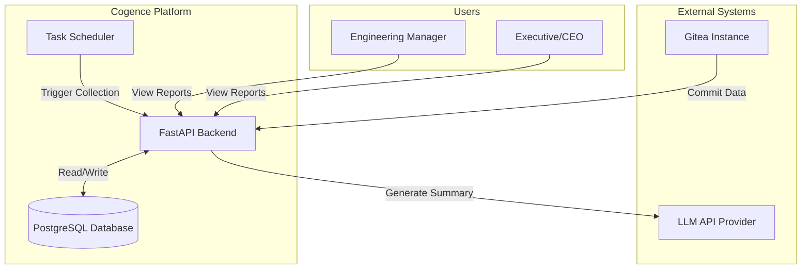
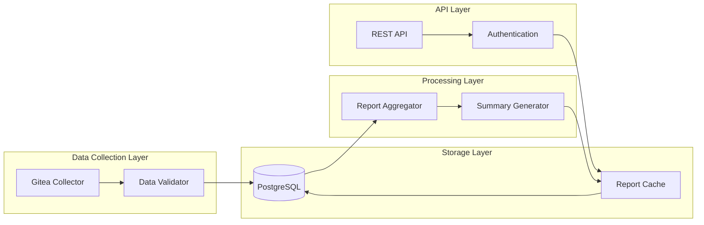
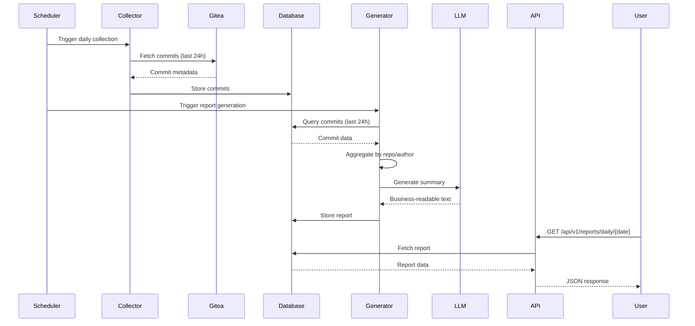
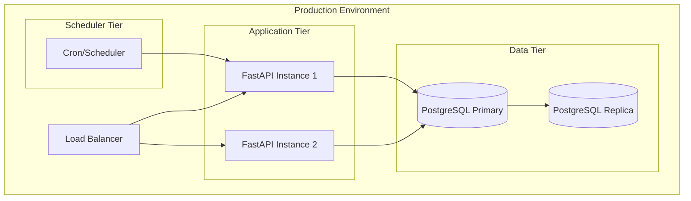

# Cogence System Architecture Overview

## Introduction

Cogence is an Engineering Intelligence Platform that transforms engineering activity into business-readable reports. This document provides a high-level overview of the system architecture for MVP v1.

**Architecture Philosophy:** Simple, maintainable, and focused on delivering business value.

**Note:** This document includes basic Mermaid diagrams. For comprehensive C4 model diagrams (Context, Container, Component, Code), see the planned architecture diagrams in the `docs/architecture/diagrams/` directory (to be added in MVP-v2+).

---

## System Context



---

## Architecture Principles

Based on our [Architecture Decision Records](../adr/):

1. **Single-Tenant, Internal-First** (ADR-008) - No multi-tenancy complexity
2. **Scheduled Processing** (ADR-011) - Batch collection, not real-time
3. **PostgreSQL as System of Record** (ADR-010) - Single source of truth
4. **Commits as Primary Signal** (ADR-001) - Focus on commit metadata
5. **No Code Analysis** (ADR-003) - No static analysis or embeddings in MVP

---

## High-Level Architecture

### Component Overview



### Core Components

#### 1. Data Collection Service
- **Purpose:** Fetch commit data from Gitea
- **Technology:** Python async/await with aiohttp
- **Trigger:** Scheduled (cron-like)
- **Output:** Commit metadata stored in PostgreSQL

#### 2. Data Storage
- **Purpose:** Persist all collected data
- **Technology:** PostgreSQL with SQLAlchemy ORM
- **Schema:** Repositories, Commits, Reports
- **Retention:** 90+ days

#### 3. Report Generation Service
- **Purpose:** Generate daily business-readable reports
- **Technology:** Python with LLM integration
- **Input:** Commit data from last 24 hours
- **Output:** Structured report with AI-generated summaries

#### 4. API Service
- **Purpose:** Expose reports and system functionality
- **Technology:** FastAPI
- **Endpoints:** Report retrieval, system health
- **Authentication:** Token-based

#### 5. Task Scheduler
- **Purpose:** Trigger scheduled operations
- **Technology:** APScheduler or similar
- **Tasks:** Daily data collection, report generation

---

## Data Flow

### Daily Report Generation Flow



### Key Data Flows

1. **Commit Collection Flow**
   - Scheduler triggers collection every 24 hours
   - Collector fetches commits from Gitea API
   - Validator ensures data quality
   - Commits stored in PostgreSQL

2. **Report Generation Flow**
   - Scheduler triggers generation after collection
   - Aggregator groups commits by repository and author
   - Generator creates report structure
   - LLM generates executive summary
   - Complete report stored in database

3. **Report Retrieval Flow**
   - User requests report via API
   - API checks cache first
   - If not cached, fetches from database
   - Returns formatted JSON response

---

## Technology Stack

### Backend
- **Language:** Python 3.11+
- **Framework:** FastAPI
- **Async Runtime:** asyncio with uvicorn
- **ORM:** SQLAlchemy (async)
- **Validation:** Pydantic v2

### Database
- **Primary:** PostgreSQL 15+
- **Migrations:** Alembic
- **Connection Pool:** asyncpg

### External Integrations
- **Git Platform:** Gitea API
- **AI/LLM:** OpenAI API or compatible
- **HTTP Client:** aiohttp

### Infrastructure
- **Scheduler:** APScheduler
- **Logging:** Python logging + structured logs
- **Monitoring:** Prometheus metrics (future)

---

## Database Schema

### Core Tables

```sql
-- Repositories
CREATE TABLE repositories (
    id SERIAL PRIMARY KEY,
    gitea_id INTEGER UNIQUE NOT NULL,
    name VARCHAR(255) NOT NULL,
    full_name VARCHAR(255) NOT NULL,
    description TEXT,
    url VARCHAR(512) NOT NULL,
    created_at TIMESTAMP NOT NULL DEFAULT NOW(),
    updated_at TIMESTAMP NOT NULL DEFAULT NOW()
);

-- Commits
CREATE TABLE commits (
    id SERIAL PRIMARY KEY,
    repository_id INTEGER REFERENCES repositories(id),
    sha VARCHAR(40) UNIQUE NOT NULL,
    author_name VARCHAR(255) NOT NULL,
    author_email VARCHAR(255) NOT NULL,
    timestamp TIMESTAMP NOT NULL,
    title VARCHAR(500) NOT NULL,
    description TEXT,
    files_changed INTEGER,
    insertions INTEGER,
    deletions INTEGER,
    created_at TIMESTAMP NOT NULL DEFAULT NOW(),
    INDEX idx_commits_timestamp (timestamp),
    INDEX idx_commits_repository (repository_id),
    INDEX idx_commits_author (author_name)
);

-- Reports
CREATE TABLE reports (
    id SERIAL PRIMARY KEY,
    report_date DATE UNIQUE NOT NULL,
    report_type VARCHAR(50) NOT NULL DEFAULT 'daily',
    executive_summary TEXT NOT NULL,
    projects_summary JSONB NOT NULL,
    contributors_summary JSONB NOT NULL,
    management_notes TEXT,
    metadata JSONB,
    generated_at TIMESTAMP NOT NULL DEFAULT NOW(),
    INDEX idx_reports_date (report_date)
);
```

See [data-model.md](data-model.md) for complete schema documentation.

---

## API Design

### REST API Structure

```
/api/v1/
├── /reports
│   ├── GET /daily/{date}          # Get daily report
│   ├── GET /daily/latest          # Get latest report
│   └── POST /daily/{date}/regenerate  # Regenerate report
├── /repositories
│   ├── GET /                      # List repositories
│   └── GET /{id}                  # Get repository details
├── /commits
│   └── GET /                      # Query commits (with filters)
└── /health
    ├── GET /                      # Health check
    └── GET /ready                 # Readiness check
```

### Example Response

```json
{
  "report_date": "2024-01-15",
  "report_type": "daily",
  "executive_summary": "Engineering focused on customer-facing improvements...",
  "projects": [
    {
      "repository": "customer-portal",
      "commit_count": 12,
      "summary": "Authentication improvements and UI enhancements"
    }
  ],
  "contributors": [
    {
      "name": "John Doe",
      "commit_count": 8,
      "summary": "Worked on authentication system"
    }
  ],
  "management_notes": "High activity on customer-facing projects...",
  "generated_at": "2024-01-16T00:30:00Z"
}
```

See [API Documentation](../api/README.md) for complete API reference.

---

## Security Architecture

### Authentication & Authorization
- **API Authentication:** Bearer token authentication
- **Token Storage:** Encrypted at rest in database
- **Access Control:** Role-based (future enhancement)

### Data Security
- **Gitea Token:** Stored encrypted in environment/secrets
- **Database:** SSL/TLS connections required
- **API:** HTTPS only in production
- **Audit Logging:** All data access logged

### Privacy Considerations (ADR-004)
- No individual developer scoring
- No surveillance features
- Aggregate data only in reports
- Transparent data collection

See [data-model.md](data-model.md) for database schema details.

---

## Deployment Architecture

### Single-Tenant Deployment (ADR-008)



### Deployment Components
- **Application Server:** Uvicorn with multiple workers
- **Database:** PostgreSQL with replication
- **Scheduler:** Systemd timer or cron
- **Reverse Proxy:** Nginx or similar
- **Monitoring:** Prometheus + Grafana (future)

### Deployment (Pilot)

Single-tenant internal deployment. Scheduler runs the nightly pipeline at 21:00 `Asia/Tehran`. Reports delivered via API and Rocket.Chat.

---

## Scalability Considerations

### Current Capacity (MVP v1)
- **Repositories:** Up to 100
- **Commits/Day:** Up to 10,000
- **Concurrent Users:** Up to 50
- **Report Generation:** < 30 seconds

### Future Scaling Options
- Horizontal scaling of API instances
- Database read replicas
- Report caching layer (Redis)
- Async report generation queue
- CDN for static content

---

## Monitoring & Observability

### Logging
- **Application Logs:** Structured JSON logs
- **Access Logs:** All API requests
- **Error Logs:** Exceptions with stack traces
- **Audit Logs:** Data collection and report generation

### Metrics (Future)
- API response times
- Report generation duration
- Database query performance
- External API call success rates
- System resource usage

### Health Checks
- `/health` - Basic health check
- `/health/ready` - Readiness check (DB connection)
- Database connectivity
- External API availability

---

## Error Handling Strategy

### Error Categories
1. **Transient Errors:** Retry with exponential backoff
2. **Configuration Errors:** Fail fast with clear messages
3. **Data Errors:** Log and skip, continue processing
4. **External Service Errors:** Graceful degradation

### Retry Logic
- Gitea API calls: 3 retries with exponential backoff
- LLM API calls: 2 retries with backoff
- Database operations: Framework-level retry

### Fallback Strategies
- If LLM unavailable: Generate basic summary from templates
- If Gitea unavailable: Use cached data, alert operators
- If database unavailable: Return cached reports (read-only mode)

---

## Development Workflow

### Local Development
```bash
# Setup
python -m venv venv
source venv/bin/activate
pip install -r requirements.txt

# Database
createdb cogence_dev
alembic upgrade head

# Run
uvicorn app.main:app --reload
```

### Testing
```bash
# Unit tests
pytest tests/unit

# Integration tests
pytest tests/integration

# Coverage
pytest --cov=app tests/
```

See [setup.md](../development/setup.md) for detailed setup instructions.

---

## Future Architecture Enhancements

### Phase 2 Considerations
- Weekly/monthly report aggregation
- Report caching layer (Redis)
- Async task queue (Celery/RQ)
- Real-time notifications
- Dashboard UI

### Phase 3 Considerations
- Multi-repository insights
- Trend analysis engine
- Risk detection algorithms
- Integration with project management tools
- Custom report templates

---

## Related Documentation

- [Data Model](data-model.md) - Complete database documentation
- [Domain Model](domain-model.md) - Core entities
- [API Reference](../api/README.md) - API endpoints and examples
- [ADRs](../adr/) - Architecture decision records

---

## Glossary

- **Commit:** A Git commit with metadata
- **Repository:** A Git repository in Gitea
- **Report:** A generated daily summary of engineering activity
- **Signal:** Data point from engineering activity (commits, PRs, etc.)
- **Summary:** AI-generated business-readable text

See [Product Glossary](../product/glossary.md) for complete terminology.