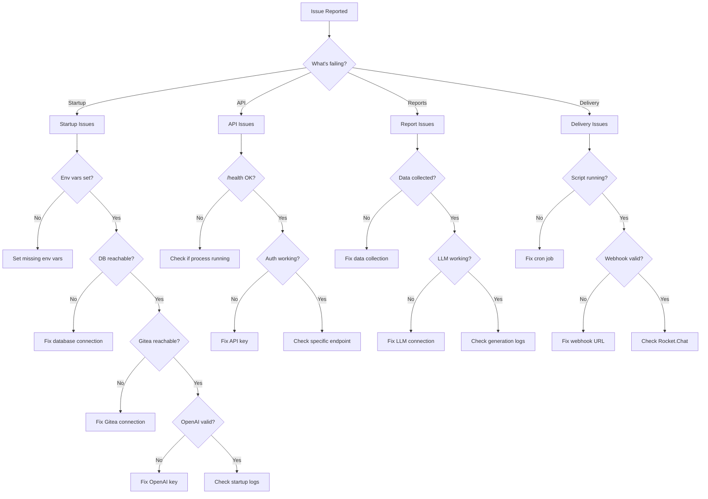

# Cogence Troubleshooting Guide

**Version:** 1.0.0  
**Last Updated:** 2026-06-24  
**Applies to:** MVP-v1+

---

## Overview

This document provides troubleshooting flowcharts and solutions for common Cogence operational issues. Use this guide to diagnose and resolve problems quickly.

---

## Quick Diagnostic Flowchart



---

## Startup Issues

### Issue: Application Won't Start

**Symptoms:**
- Process exits immediately
- Error messages on startup
- Container keeps restarting

**Diagnostic Steps:**

1. **Check environment variables:**
   ```bash
   # Verify all required vars are set
   env | grep -E 'DATABASE_URL|API_SECRET_KEY|GITEA_|OPENAI_'
   ```

2. **Check logs:**
   ```bash
   # Docker
   docker-compose logs cogence
   
   # Systemd
   journalctl -u cogence -n 50
   ```

3. **Test database connection:**
   ```bash
   psql $DATABASE_URL -c "SELECT 1"
   ```

4. **Test Gitea connection:**
   ```bash
   curl -H "Authorization: token $GITEA_TOKEN" \
     $GITEA_URL/api/v1/user
   ```

5. **Test OpenAI key:**
   ```bash
   curl https://api.openai.com/v1/models \
     -H "Authorization: Bearer $OPENAI_API_KEY"
   ```

**Common Solutions:**

| Error | Solution |
|-------|----------|
| `Missing required environment variable` | Set the variable in `.env` file |
| `DATABASE_URL must be a PostgreSQL connection string` | Fix DATABASE_URL format |
| `Database connection failed` | Check PostgreSQL is running and accessible |
| `Gitea authentication failed` | Verify GITEA_TOKEN is valid |
| `OpenAI authentication failed` | Verify OPENAI_API_KEY is valid |

---

### Issue: Database Migration Fails

**Symptoms:**
- `alembic upgrade head` fails
- Database schema errors
- Migration conflicts

**Diagnostic Steps:**

1. **Check current migration version:**
   ```bash
   alembic current
   ```

2. **Check migration history:**
   ```bash
   alembic history
   ```

3. **Check database connection:**
   ```bash
   psql $DATABASE_URL -c "\dt"
   ```

**Solutions:**

```bash
# Reset to specific version
alembic downgrade <revision>

# Stamp current version (if manually fixed)
alembic stamp head

# Generate new migration
alembic revision --autogenerate -m "description"

# Apply migrations
alembic upgrade head
```

---

## API Issues

### Issue: API Returns 503 Service Unavailable

**Symptoms:**
- `/health/ready` returns 503
- API requests fail
- "Service unavailable" errors

**Diagnostic Steps:**

1. **Check health endpoint:**
   ```bash
   curl http://localhost:8000/health/ready
   ```

2. **Identify failing component:**
   ```json
   {
     "status": "degraded",
     "checks": {
       "database": {"status": "error", "message": "..."},
       "gitea": {"status": "ok"},
       "openai": {"status": "ok"}
     }
   }
   ```

3. **Fix the failing component:**
   - Database: Check PostgreSQL status
   - Gitea: Check Gitea accessibility
   - OpenAI: Check API key validity

---

### Issue: API Returns 401 Unauthorized

**Symptoms:**
- All API requests return 401
- "Unauthorized" error
- Authentication fails

**Diagnostic Steps:**

1. **Verify API key:**
   ```bash
   echo $COGENCE_API_KEY
   ```

2. **Test authentication:**
   ```bash
   curl -H "Authorization: Bearer $COGENCE_API_KEY" \
     http://localhost:8000/health
   ```

3. **Check server configuration:**
   ```bash
   # In server environment
   echo $API_SECRET_KEY
   ```

**Solution:**
- Ensure `COGENCE_API_KEY` (client) matches `API_SECRET_KEY` (server)
- Update `.env` file if needed
- Restart application after changing keys

---

### Issue: Slow API Response Times

**Symptoms:**
- Requests take > 5 seconds
- Timeouts
- Poor performance

**Diagnostic Steps:**

1. **Check database performance:**
   ```sql
   -- Check slow queries
   SELECT query, mean_exec_time, calls
   FROM pg_stat_statements
   ORDER BY mean_exec_time DESC
   LIMIT 10;
   ```

2. **Check database connections:**
   ```sql
   SELECT count(*) FROM pg_stat_activity;
   ```

3. **Check system resources:**
   ```bash
   # CPU and memory
   top
   
   # Disk I/O
   iostat -x 1
   ```

**Solutions:**
- Add database indexes
- Increase connection pool size
- Optimize slow queries
- Scale up resources
- Enable report caching

---

## Report Generation Issues

### Issue: Report Generation Fails

**Symptoms:**
- `POST /api/v1/reports/daily/{date}/generate` returns 500
- "Report generation failed" error
- No report created

**Diagnostic Steps:**

1. **Check if commits exist:**
   ```bash
   curl -H "Authorization: Bearer $COGENCE_API_KEY" \
     "http://localhost:8000/api/v1/commits?date=2026-06-23"
   ```

2. **Check LLM connectivity:**
   ```bash
   curl https://api.openai.com/v1/models \
     -H "Authorization: Bearer $OPENAI_API_KEY"
   ```

3. **Check application logs:**
   ```bash
   docker-compose logs cogence | grep -i error
   ```

**Common Errors:**

| Error | Cause | Solution |
|-------|-------|----------|
| `No commits found for date` | Data collection didn't run | Run data collection manually |
| `OpenAI API error` | LLM API issue | Check OpenAI status, verify key |
| `Token limit exceeded` | Too many commits | Reduce commit count or increase token limit |
| `Database error` | DB connection issue | Check database connectivity |

---

### Issue: Empty Report Generated

**Symptoms:**
- Report generated but has no content
- `total_commits: 0`
- Empty repositories and contributors arrays

**Diagnostic Steps:**

1. **Verify commits were collected:**
   ```sql
   SELECT COUNT(*) FROM commits 
   WHERE DATE(timestamp AT TIME ZONE 'Asia/Tehran') = '2026-06-23';
   ```

2. **Check data collection logs:**
   ```bash
   docker-compose logs cogence | grep commit_collection
   ```

3. **Verify repository configuration:**
   ```bash
   curl -H "Authorization: Bearer $COGENCE_API_KEY" \
     http://localhost:8000/api/v1/repositories
   ```

**Solutions:**
- Run data collection: `python -m app.collector`
- Check Gitea repository access
- Verify date range is correct
- Check timezone configuration

---

### Issue: LLM Token Limit Exceeded

**Symptoms:**
- "Token limit exceeded" error
- Report generation fails
- High token usage

**Diagnostic Steps:**

1. **Check commit count:**
   ```sql
   SELECT DATE(timestamp AT TIME ZONE 'Asia/Tehran') as date,
          COUNT(*) as commits
   FROM commits
   GROUP BY date
   ORDER BY date DESC
   LIMIT 7;
   ```

2. **Check diff sizes:**
   ```sql
   SELECT AVG(LENGTH(diff_truncated)) as avg_diff_size
   FROM commits
   WHERE DATE(timestamp AT TIME ZONE 'Asia/Tehran') = '2026-06-23';
   ```

**Solutions:**
- Reduce diff truncation limit
- Filter out large commits
- Use smaller LLM model
- Split report generation into batches
- Increase token limit (if using custom model)

---

## Data Collection Issues

### Issue: No Commits Being Collected

**Symptoms:**
- Database has no recent commits
- Reports are empty
- Data collection logs show no activity

**Diagnostic Steps:**

1. **Check Gitea connectivity:**
   ```bash
   curl -H "Authorization: token $GITEA_TOKEN" \
     "$GITEA_URL/api/v1/repos/search"
   ```

2. **Check repository access:**
   ```bash
   curl -H "Authorization: token $GITEA_TOKEN" \
     "$GITEA_URL/api/v1/user/repos"
   ```

3. **Run collection manually:**
   ```bash
   python -m app.collector
   ```

4. **Check logs:**
   ```bash
   docker-compose logs cogence | grep collector
   ```

**Common Issues:**

| Issue | Solution |
|-------|----------|
| Gitea token expired | Generate new token in Gitea |
| No repository access | Grant token access to repositories |
| Network timeout | Check network connectivity |
| Rate limiting | Add delays between requests |

---

### Issue: Duplicate Commits

**Symptoms:**
- Same commit appears multiple times
- Inflated commit counts
- Duplicate entries in database

**Diagnostic Steps:**

1. **Check for duplicates:**
   ```sql
   SELECT sha, COUNT(*) 
   FROM commits 
   GROUP BY sha 
   HAVING COUNT(*) > 1;
   ```

2. **Check collection logs:**
   ```bash
   docker-compose logs cogence | grep "duplicate"
   ```

**Solutions:**
- Add unique constraint on `sha` column (should already exist)
- Use `INSERT ... ON CONFLICT DO NOTHING`
- Clear duplicates manually:
  ```sql
  DELETE FROM commits a USING commits b
  WHERE a.id > b.id AND a.sha = b.sha;
  ```

---

## Delivery Issues

### Issue: Reports Not Delivered to Rocket.Chat

**Symptoms:**
- Cron job runs but no message in Rocket.Chat
- `deliver.sh` fails
- Webhook errors

**Diagnostic Steps:**

1. **Check cron job:**
   ```bash
   # Check if cron job exists
   crontab -l | grep deliver
   
   # Check cron logs
   grep deliver /var/log/cron
   ```

2. **Run delivery script manually:**
   ```bash
   ./scripts/deliver.sh
   ```

3. **Check webhook:**
   ```bash
   curl -X POST -H "Content-Type: application/json" \
     -d '{"text":"Test message"}' \
     $ROCKETCHAT_WEBHOOK
   ```

**Common Issues:**

| Issue | Solution |
|-------|----------|
| Wrong webhook URL | Update ROCKETCHAT_WEBHOOK in .env |
| Webhook disabled | Re-enable webhook in Rocket.Chat |
| Network issue | Check connectivity to Rocket.Chat server |
| Cron not running | Start cron service |
| Wrong timezone | Set TZ=Asia/Tehran in cron job |

See [deliver-error-handling.md](deliver-error-handling.md) for detailed delivery troubleshooting.

---

## Performance Issues

### Issue: High Memory Usage

**Symptoms:**
- Memory usage > 80%
- OOM (Out of Memory) errors
- Application crashes

**Diagnostic Steps:**

1. **Check memory usage:**
   ```bash
   free -h
   docker stats
   ```

2. **Check for memory leaks:**
   ```bash
   # Monitor over time
   watch -n 5 'docker stats --no-stream'
   ```

3. **Check database connection pool:**
   ```python
   # In application
   print(engine.pool.status())
   ```

**Solutions:**
- Reduce connection pool size
- Add memory limits to Docker
- Optimize queries to use less memory
- Add pagination to large result sets
- Restart application periodically
- Scale up server resources

---

### Issue: High CPU Usage

**Symptoms:**
- CPU usage > 80%
- Slow response times
- High load average

**Diagnostic Steps:**

1. **Check CPU usage:**
   ```bash
   top
   htop
   ```

2. **Check slow queries:**
   ```sql
   SELECT query, total_exec_time, calls
   FROM pg_stat_statements
   ORDER BY total_exec_time DESC
   LIMIT 10;
   ```

3. **Profile application:**
   ```bash
   # Use py-spy for profiling
   py-spy top --pid <pid>
   ```

**Solutions:**
- Add database indexes
- Optimize slow queries
- Reduce LLM request frequency
- Add caching
- Scale horizontally

---

## Database Issues

### Issue: Database Connection Pool Exhausted

**Symptoms:**
- "Connection pool exhausted" errors
- Timeouts on database operations
- Slow queries

**Diagnostic Steps:**

1. **Check active connections:**
   ```sql
   SELECT count(*) FROM pg_stat_activity;
   ```

2. **Check pool status:**
   ```python
   print(engine.pool.status())
   ```

3. **Check for long-running queries:**
   ```sql
   SELECT pid, now() - query_start as duration, query
   FROM pg_stat_activity
   WHERE state = 'active'
   ORDER BY duration DESC;
   ```

**Solutions:**
- Increase pool size in configuration
- Kill long-running queries
- Add connection timeouts
- Fix slow queries
- Add connection pooling (PgBouncer)

---

### Issue: Database Disk Full

**Symptoms:**
- "No space left on device" errors
- Write operations fail
- Database crashes

**Diagnostic Steps:**

1. **Check disk usage:**
   ```bash
   df -h
   du -sh /var/lib/postgresql/data/*
   ```

2. **Check table sizes:**
   ```sql
   SELECT schemaname, tablename,
          pg_size_pretty(pg_total_relation_size(schemaname||'.'||tablename))
   FROM pg_tables
   ORDER BY pg_total_relation_size(schemaname||'.'||tablename) DESC;
   ```

**Solutions:**
- Delete old data
- Vacuum database: `VACUUM FULL;`
- Archive old reports
- Increase disk space
- Add data retention policy

---

## Monitoring and Alerting

### Setting Up Alerts

**Critical Alerts:**
```bash
# Check if service is down
if ! curl -f http://localhost:8000/health; then
    echo "Cogence is down!" | mail -s "CRITICAL: Cogence Down" admin@example.com
fi

# Check if database is unreachable
if ! curl -f http://localhost:8000/health/ready; then
    echo "Database unreachable!" | mail -s "CRITICAL: DB Down" admin@example.com
fi
```

**Warning Alerts:**
```bash
# Check disk space
DISK_USAGE=$(df -h / | awk 'NR==2 {print $5}' | sed 's/%//')
if [ $DISK_USAGE -gt 80 ]; then
    echo "Disk usage: ${DISK_USAGE}%" | mail -s "WARNING: Disk Space" admin@example.com
fi

# Check memory usage
MEM_USAGE=$(free | awk 'NR==2 {printf "%.0f", $3/$2*100}')
if [ $MEM_USAGE -gt 80 ]; then
    echo "Memory usage: ${MEM_USAGE}%" | mail -s "WARNING: Memory" admin@example.com
fi
```

---

## Emergency Procedures

### Complete System Restart

```bash
# 1. Stop all services
docker-compose down

# 2. Check for issues
docker-compose logs | grep -i error

# 3. Fix any configuration issues
vim .env

# 4. Start services
docker-compose up -d

# 5. Verify health
curl http://localhost:8000/health/ready

# 6. Check logs
docker-compose logs -f
```

---

### Database Recovery

```bash
# 1. Stop application
docker-compose stop cogence

# 2. Backup database
pg_dump $DATABASE_URL > backup_$(date +%Y%m%d_%H%M%S).sql

# 3. Check database integrity
psql $DATABASE_URL -c "SELECT pg_database.datname, pg_size_pretty(pg_database_size(pg_database.datname)) FROM pg_database;"

# 4. Vacuum if needed
psql $DATABASE_URL -c "VACUUM FULL;"

# 5. Restart application
docker-compose start cogence
```

---

## Getting Help

### Log Collection

When reporting issues, collect these logs:

```bash
# Application logs
docker-compose logs cogence > cogence.log

# Database logs
docker-compose logs postgres > postgres.log

# System info
uname -a > system.log
docker version >> system.log
docker-compose version >> system.log

# Configuration (sanitized)
env | grep -E 'COGENCE|GITEA|OPENAI' | sed 's/=.*/=***/' > config.log

# Create archive
tar -czf cogence-logs-$(date +%Y%m%d).tar.gz *.log
```

---

## Related Documentation

- [Monitoring Guide](monitoring.md) - Monitoring and observability
- [Error Handling](deliver-error-handling.md) - Delivery script errors
- [System Overview](../architecture/system-overview.md) - Architecture details
- [Development Setup](../development/setup.md) - Setup instructions

---

**Last Updated:** 2026-06-24  
**Version:** 1.0.0  
**Next Review:** After MVP-v2 deployment