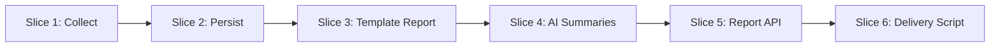

# Cogence MVP v1 — Product Slices

## Overview

Vertical slices for building the MVP v1 pilot. Each slice is independently demoable and adds user-visible value.

**Pilot delivery:** REST API + external cron/bash posting to Rocket.Chat at **07:00** `Asia/Tehran` (next-morning delivery). No dashboard. No built-in scheduler or chat integration in Cogence.

See [MVP-v1.md](MVP-v1.md) for scope and [user-stories.md](../user-stories.md) for pilot stories.

---

## Slice 1: Collect Commits from Gitea

**Goal:** Prove we can read engineering signals from Gitea for a calendar day.

**User value:** Engineering activity is visible as raw structured data.

**Scope:**

- Connect to Gitea with URL + token
- Discover all accessible repositories
- Fetch commits for a calendar day (`Asia/Tehran`)
- Run as a CLI script or one-off job (no scheduler yet)

**Done when:**

- Script outputs commit metadata (repo, SHA, author, timestamp, title, description)
- Handles invalid credentials with a clear error
- Skips duplicate SHAs on re-run

**Maps to:** AC-1.1, AC-1.2, AC-1.3 (partial)

---

## Slice 2: Persist Commits

**Goal:** Commits become the system of record.

**User value:** Data survives restarts and supports historical queries.

**Scope:**

- PostgreSQL schema: `repositories`, `commits`
- Alembic migration
- Idempotent ingest (SHA unique constraint)
- Query commits by date range

**Done when:**

- Commits stored with repository relationship
- Query by date returns correct commits with Tehran calendar-day boundary
- Re-ingest does not create duplicates

**Maps to:** AC-2.1, AC-2.2, AC-2.3

---

## Slice 3: Template Report (No LLM)

**Goal:** Validate aggregation and report structure before AI.

**User value:** Internal proof that commit → report JSON works.

**Scope:**

- Aggregate commits by repository and contributor (raw Git author identity)
- Build report JSON matching [sample-report.json](../../examples/sample-report.json) shape
- Template text for executive summary and sections
- Empty day copy per [MVP-v1.md](MVP-v1.md)
- No commit-count emphasis in contributor-facing text

**Done when:**

- Report JSON generated from stored commits
- All four sections present (executive summary, active repositories, contributors, management notes)
- Empty day produces explicit "no activity" report

**Note:** Template reports are for **internal validation**. Manager demos require Slice 4.

**Maps to:** AC-3.1–AC-3.4 (structure), AC-11.2 (factual basis)

---

## Slice 4: AI Summaries

**Goal:** Business-language reports managers can read in under 60 seconds.

**User value:** Non-technical managers understand what engineering accomplished without reading Git.

**Scope:**

- LLM integration per [report-generation.md](../../ai/report-generation.md)
- Fetch **truncated unified diffs** at generation time; discard after generation ([ADR-012](../../adr/ADR-012-truncated-diff-for-llm-translation.md))
- Configurable **Report Locale** (`fa`, `en`)
- Prompts for all four sections
- Neutral **Observability Gap** notes when commit messages are too vague
- Fallback template when LLM fails (AC-7.2)
- Mark AI-generated content in metadata

**Done when:**

- Summaries use business language in configured locale
- No invented repositories or contributors
- Vague commit messages still produce grounded summaries via truncated diffs
- Generation completes in under 30 seconds for typical daily volume (~20 repos, <6 active)
- Fallback works when LLM is unavailable

**Maps to:** AC-3.1–AC-3.5, AC-7.2

---

## Slice 5: Report API

**Goal:** Reports are generatable and retrievable on demand.

**User value:** External tools (bash, cron, future UI) can drive the pilot.

**Scope:**

- `POST /api/v1/reports/daily/{date}/generate?depth=standard` — idempotent collect → generate → return
- `GET /api/v1/reports/daily/{date}`
- `GET /api/v1/reports/daily/latest`
- Store reports in database after generation
- Basic bearer-token auth
- `/health` and `/health/ready`
- `{date}` is explicit `YYYY-MM-DD` (Asia/Tehran calendar day); no magic "yesterday"

**Done when:**

- `generate` is idempotent (safe to re-run for same date)
- API returns valid JSON matching report schema
- `GET` returns stored report; 404 only if never generated
- Empty-day `generate` stores and returns empty report
- Response time under 2 seconds for `GET`
- Health endpoints work

**Maps to:** AC-4.1, AC-4.2, AC-8.1, AC-8.2, AC-9.1 (basic)

---

## Slice 6: Example Delivery Script

**Goal:** Prove end-to-end manager delivery without building chat integration into Cogence.

**User value:** Manager receives report in Rocket.Chat every morning.

**Scope:**

- Example bash script in `scripts/` (not part of the FastAPI app)
- Cron at **07:00 Asia/Tehran**
- Script computes yesterday's `{date}` in Tehran timezone
- Calls `POST .../daily/{date}/generate`
- Formats JSON and posts to Rocket.Chat webhook via `curl`
- Document setup in development docs

**Done when:**

- Script runs manually and via cron
- Manager-readable message posted to Rocket.Chat
- Cogence itself has no Rocket.Chat or scheduler code

**Maps to:** Story P7 (delivery path, external)

---

## Deferred Slices (Backlog)

| Was | Deferred to |
|-----|-------------|
| Slice 6: Internal scheduler at 21:00 | External cron (Slice 6 above) |
| Slice 7: Built-in Rocket.Chat | [backlog.md](../backlog.md) — future native channels |
| Report depth `brief` / `deep` | [backlog.md](../backlog.md) |
| Contributor identity merging | [backlog.md](../backlog.md) |
| Repository allowlists | [backlog.md](../backlog.md) |

---

## Build Order

| Order | Slice | Demo |
|-------|-------|------|
| 1 | Collect | CLI prints commits |
| 2 | Persist | Commits in DB, query by date |
| 3 | Template Report | JSON file or stdout (internal) |
| 4 | AI Summaries | Persian business-language report |
| 5 | Report API | `curl` generate + get report |
| 6 | Delivery Script | Message in Rocket.Chat at 07:00 |

---

## Out of Scope Per Slice

Do **not** build during pilot slices:

- Web dashboard or UI
- Built-in Rocket.Chat, Telegram, SMS, or email delivery
- Internal job scheduler
- Commit-count leaderboards or activity sorting
- Weekly or monthly reports
- Repository filters, contributor merging, or team grouping
- Report depth tiers beyond `standard`
- Prometheus / Grafana
- Advanced risk detection

See [backlog.md](../backlog.md).

---

## Pilot Exit Criteria

Pilot is complete when:

1. `POST .../daily/{date}/generate` produces a correct report idempotently
2. Example bash script delivers yesterday's report to Rocket.Chat at 07:00 Asia/Tehran
3. At least one manager confirms readability in under 60 seconds (Persian locale)
4. Factual accuracy spot-check passes on commit data
5. No surveillance patterns in report output (rankings, scores, count comparisons, "bad committer" labels)

---

## Related Documentation

- [MVP v1 Specification](MVP-v1.md)
- [Pilot User Stories](../user-stories.md)
- [Acceptance Criteria](../acceptance-criteria.md)
- [AI Report Generation](../../ai/report-generation.md)
- [Grilling Decisions (2026-06-19)](grilling-decisions-2026-06-19.md)

---

**Last Updated:** 2026-06-19
