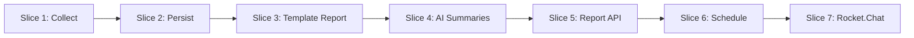

# Cogence MVP v1 — Product Slices

## Overview

Vertical slices for building the MVP v1 pilot. Each slice is independently demoable and adds user-visible value.

**Pilot delivery:** API + Rocket.Chat at 21:00 `Asia/Tehran`. No dashboard.

See [MVP-v1.md](MVP-v1.md) for scope and [user-stories.md](../user-stories.md) for pilot stories.

---

## Slice 1: Collect Commits from Gitea

**Goal:** Prove we can read yesterday's engineering signals from Gitea.

**User value:** Engineering activity is visible as raw structured data.

**Scope:**

- Connect to Gitea with URL + token
- Discover accessible repositories
- Fetch commits for a calendar day (`Asia/Tehran`)
- Run as a CLI script or one-off job (no scheduler yet)

**Done when:**

- Script outputs commit metadata (repo, SHA, author, timestamp, title, description)
- Handles invalid credentials with a clear error
- Skips duplicate SHAs on re-run

**Maps to:** AC-1.1, AC-1.2, AC-1.3 (partial)

---

## Slice 2: Persist Commits

**Goal:** Commits become the system of record.

**User value:** Data survives restarts and supports historical queries.

**Scope:**

- PostgreSQL schema: `repositories`, `commits`
- Alembic migration
- Idempotent ingest (SHA unique constraint)
- Query commits by date range

**Done when:**

- Commits stored with repository relationship
- `GET` query by date returns correct commits in UTC with Tehran calendar-day boundary
- Re-ingest does not create duplicates

**Maps to:** AC-2.1, AC-2.2, AC-2.3

---

## Slice 3: Template Report (No LLM)

**Goal:** Validate aggregation and report structure before AI.

**User value:** A deterministic daily report managers can read — even without LLM.

**Scope:**

- Aggregate commits by repository and contributor
- Build report JSON matching [sample-report.json](../../examples/sample-report.json) shape
- Template text for executive summary and sections
- No commit-count emphasis in contributor-facing text

**Done when:**

- Report JSON generated from stored commits
- All four sections present (executive summary, active repositories, contributors, management notes)
- Empty day produces explicit "no activity" report

**Maps to:** AC-3.1–AC-3.4 (structure), AC-11.2 (factual basis)

---

## Slice 4: AI Summaries

**Goal:** Replace template text with business-language summaries.

**User value:** Reports read naturally for non-technical managers.

**Scope:**

- LLM integration per [report-generation.md](../../ai/report-generation.md)
- Prompts for all four sections
- Fallback template when LLM fails (AC-7.2)
- Mark AI-generated content in metadata

**Done when:**

- Summaries use business language
- No invented repositories or contributors
- Generation completes in under 30 seconds for typical daily volume
- Fallback works when LLM is unavailable

**Maps to:** AC-3.1–AC-3.5, AC-7.2

---

## Slice 5: Report API

**Goal:** Reports are retrievable on demand.

**User value:** Any tool can fetch the latest or historical report.

**Scope:**

- `GET /api/v1/reports/daily/{date}`
- `GET /api/v1/reports/daily/latest`
- Store reports in database after generation
- Basic bearer-token auth
- `/health` and `/health/ready`

**Done when:**

- API returns valid JSON matching report schema
- 404 for missing dates
- Response time under 2 seconds
- Health endpoints work

**Maps to:** AC-4.1, AC-4.2, AC-8.1, AC-8.2, AC-9.1 (basic)

---

## Slice 6: Scheduled Pipeline

**Goal:** Reports run automatically every night.

**User value:** Managers receive reports without manual intervention.

**Scope:**

- Scheduler triggers at **21:00 Asia/Tehran**
- Pipeline: collect → store → generate → persist
- Config via environment variables
- Collection status logging

**Done when:**

- Full pipeline runs on schedule
- Report period = calendar day in `Asia/Tehran`
- Failures logged with context
- Duplicate collection handled safely

**Maps to:** AC-5.1, AC-5.2, AC-6.1, AC-6.2, Story P1, P6, P9

---

## Slice 7: Rocket.Chat Delivery

**Goal:** Report arrives where managers already work.

**User value:** No dashboard — report appears in team chat at 21:00.

**Scope:**

- Post formatted message to configured Rocket.Chat webhook/channel
- Include executive summary and scannable sections
- Log delivery success/failure
- Optional: retry on transient failure

**Done when:**

- Message posted at 21:00 Asia/Tehran after report generation
- Readable in under 60 seconds in chat format
- API still available as alternate access path

**Maps to:** Story P7

---

## Build Order

| Order | Slice | Demo |
|-------|-------|------|
| 1 | Collect | CLI prints commits |
| 2 | Persist | Commits in DB, query by date |
| 3 | Template Report | JSON file or stdout |
| 4 | AI Summaries | Business-language report |
| 5 | Report API | `curl` latest report |
| 6 | Schedule | Automatic nightly run |
| 7 | Rocket.Chat | Message in channel at 21:00 |

---

## Out of Scope Per Slice

Do **not** build during pilot slices:

- Web dashboard or UI
- Commit-count leaderboards or activity sorting
- Email / Slack delivery
- Weekly or monthly reports
- Repository filters or team grouping
- Prometheus / Grafana
- Advanced risk detection

See [backlog.md](../backlog.md).

---

## Pilot Exit Criteria

All slices complete when:

1. Nightly report runs at 21:00 Asia/Tehran without manual steps
2. Report delivered to Rocket.Chat and available via API
3. Three managers confirm readability in under 60 seconds
4. Factual accuracy spot-check passes on commit data
5. No surveillance patterns in report output (rankings, scores, count comparisons)

---

## Related Documentation

- [MVP v1 Specification](MVP-v1.md)
- [Pilot User Stories](../user-stories.md)
- [Acceptance Criteria](../acceptance-criteria.md)
- [AI Report Generation](../../ai/report-generation.md)

---

**Last Updated:** 2026-06-18
